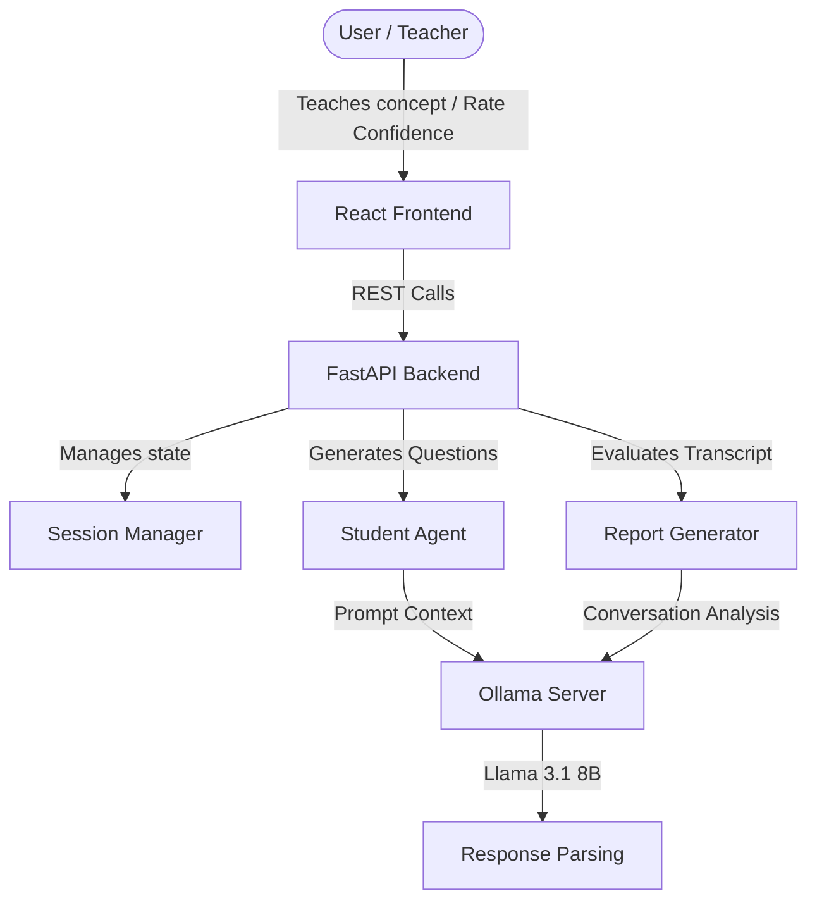

# Curio — System Architecture

Curio operates as a local-first active learning helper designed to assess and map cognitive understanding.

## 1. Key Components

- **React Frontend**: Main interface featuring Aether-inspired responsive SaaS styling. Integrates confidence ratings, a collapsible explanation drawer ("Why I asked this"), an AI thinking indicator, and an interactive radar chart.
- **FastAPI Backend**: Acts as the router, handling session state, prompt injection, validation, and JSON parsing retry workflows.
- **Ollama AI Integration**: Runs Llama 3.1 (8B) locally. Keeps user data secure and private on their local machine.

## 2. Active Learning Loop

1. **Self-Rating (Pre-session)**: User rates their topic confidence (1-10).
2. **Teaching Phase**: The user explains a concept in their own words.
3. **Adaptive Questioning**: Curio acts as a curious student, calling the LLM to inspect the user's statements and return a targeted follow-up question and its underlying reasoning.
4. **Cognitive Report (Post-session)**: The generator constructs a full transcript, computes dimension scores (Clarity, Completeness, Accuracy, Depth), charts the results on a radar, and compares self-rated confidence with demonstrated understanding to highlight the **Confidence Gap**.
